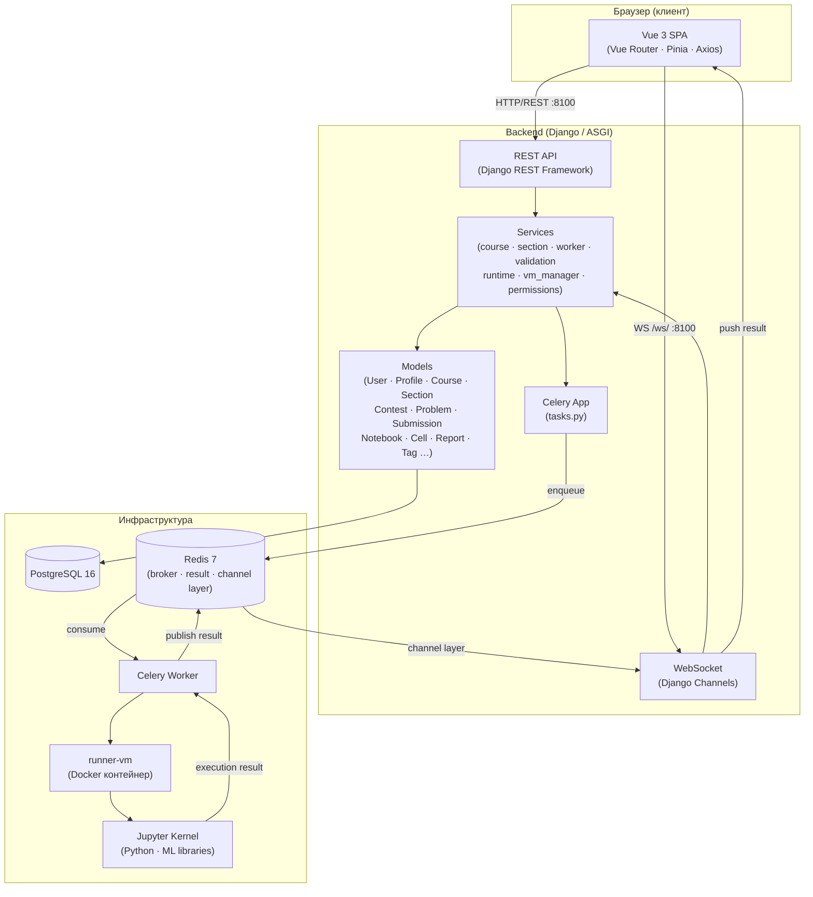
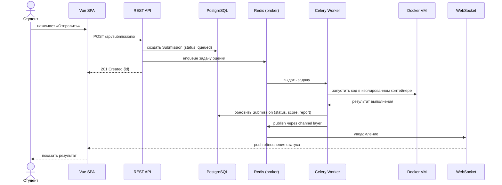
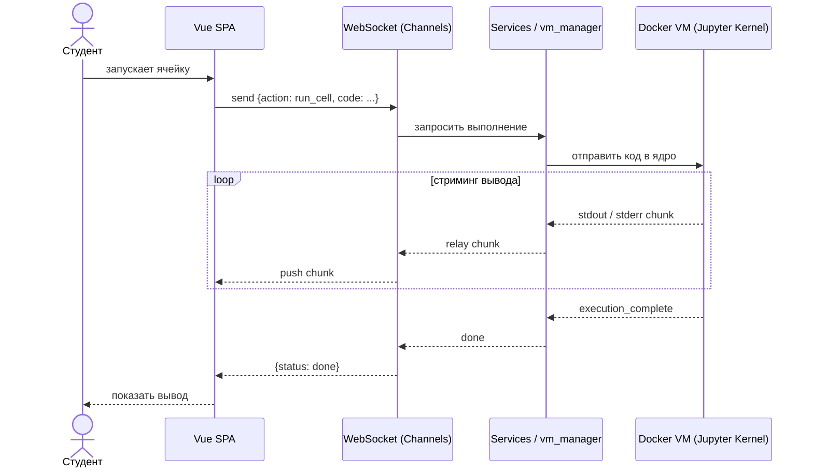

# Архитектура проекта booml

**booml** — платформа для обучения машинному обучению: студенты решают задачи в браузере (Jupyter-совместимые ноутбуки), отправляют решения на проверку и отслеживают прогресс в курсах и контестах.

---

## Компоненты системы



---

## Уровни архитектуры

| Уровень | Технологии | Назначение |
|---|---|---|
| **Фронтенд** | Vue 3, Vue Router 4, Pinia, Axios, markdown-it + KaTeX | SPA: курсы, контесты, ноутбуки, результаты |
| **REST API** | Django REST Framework, simplejwt | CRUD ресурсов, аутентификация (JWT) |
| **WebSocket** | Django Channels, Redis channel layer | Стриминг вывода ячеек, уведомления |
| **Services** | Python (бизнес-логика) | Оценка решений, управление ВМ, права доступа |
| **Task Queue** | Celery, Redis broker | Асинхронное выполнение решений |
| **Runtime** | Docker (runner-vm), Jupyter kernels | Изолированное выполнение кода пользователей |
| **База данных** | PostgreSQL 16 | Хранение всех сущностей |
| **Кэш / брокер** | Redis 7 | Celery broker + result backend + channel layer |

---

## Ключевые потоки данных

### 1. Отправка решения (submission)



### 2. Интерактивное выполнение ячейки ноутбука



---

## Структура директорий

```
booml/
├── backend/
│   ├── core/               # Настройки Django, ASGI/WSGI
│   ├── runner/
│   │   ├── api/            # REST: сериализаторы, представления, urls.py
│   │   ├── models/         # ORM-модели
│   │   ├── services/       # Бизнес-логика, runtime, vm_manager, Channels-consumers
│   │   ├── forms/          # Django-формы
│   │   ├── management/     # Управляющие команды
│   │   └── tests/          # Тесты
│   ├── docker/             # Dockerfile и bootstrap для runner-vm
│   └── requirements.txt
├── frontend/
│   ├── src/
│   │   ├── api/            # Axios-клиент
│   │   ├── components/     # Переиспользуемые компоненты
│   │   ├── pages/          # Страницы (Course, Contest, Notebook, …)
│   │   ├── router/         # Vue Router
│   │   ├── stores/         # Pinia stores
│   │   └── styles/         # Глобальные стили
│   └── package.json
├── data/                   # Наборы задач и контестов (Markdown)
└── docker-compose.yml
```
